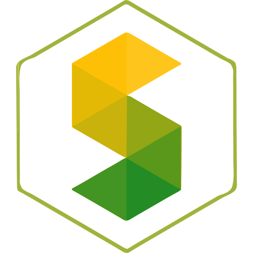

<!-- Don't delete it -->
<div name="readme-top"></div>

<!-- Organization Logo -->
<div align="center" style="display: flex; align-items: center; justify-content: center; gap: 16px;">
  
</div>

&nbsp;

<!-- Organization Name -->
<div align="center">

[](https://stability.nexus/)

</div>

<!-- Organization/Project Social Handles -->
<p align="center">
<!-- Telegram -->
<a href="https://t.me/StabilityNexus">
</a>
&nbsp;&nbsp;
<!-- X (formerly Twitter) -->
<a href="https://x.com/StabilityNexus">
</a>
&nbsp;&nbsp;
<!-- Discord -->
<a href="https://discord.gg/YzDKeEfWtS">
</a>
&nbsp;&nbsp;
<!-- Medium -->
<a href="https://news.stability.nexus/">
  </a>
&nbsp;&nbsp;
<!-- LinkedIn -->
<a href="https://linkedin.com/company/stability-nexus">
  </a>
&nbsp;&nbsp;
<!-- Youtube -->
<a href="https://www.youtube.com/@StabilityNexus">
  </a>
</p>

---

<div align="center">
<h1>Orb Oracle (Smart Contracts)</h1>
</div>

Orb Oracle is a decentralized price feed framework utilizing time-decayed weighted averages, dynamic staking weights, and governance-driven access control. It also supports composed pair feeds (cross-asset multiplication and division).

## Value Ranges

Orb Oracle exposes a current value together with a minimum and maximum value. This range helps represent uncertainty around the reported value.

Many real world values are not best represented as one exact number. Exchange rates can have a spread, and measured values can have uncertainty. Because of this, the oracle provides the value range directly instead of requiring each consumer to calculate it separately.

Current Orb oracles estimate this range from recent sampled history. The sample size is configured inside the oracle, while the shared interface keeps the range read functions parameter free.

Orb oracles may expose history for transparency and composed oracle logic, but history access is not required by the shared oracle interface.

---

## Tech Stack

* **Smart Contracts:** Solidity (^0.8.20)
* **Development Framework:** [Foundry](https://getfoundry.sh/) (Forge, Cast, Anvil)
* **Libraries:** OpenZeppelin Contracts, Forge Standard Library (`forge-std`)

---

## Getting Started

### Prerequisites

* [Git](https://git-scm.com/)
* [Foundry](https://getfoundry.sh/) (Forge, Cast, Anvil)

### Installation & Compilation

#### 1. Clone the Repository
```bash
git clone https://github.com/StabilityNexus/OrbOracle-Solidity.git
cd OrbOracle-Solidity
```

#### 2. Install Submodules & Dependencies
```bash
forge install
```

#### 3. Build the Smart Contracts
```bash
forge build
```

#### 4. Run the Unit Tests
```bash
forge test
```

---

## Contributing

We welcome contributions of all kinds! To contribute:

1. Fork the repository and create your feature branch (`git checkout -b feature/AmazingFeature`).
2. Commit your changes (`git commit -m 'Add some AmazingFeature'`).
3. Run the development workflow commands to ensure code quality:
   - `forge fmt`
   - `forge test`
4. Push your branch (`git push origin feature/AmazingFeature`).
5. Open a Pull Request for review.

If you encounter bugs, need help, or have feature requests:

* Please open an issue in this repository providing detailed information.
* Describe the problem clearly and include any relevant logs or screenshots.

We appreciate your feedback and contributions!

© 2025 The Stable Order.
